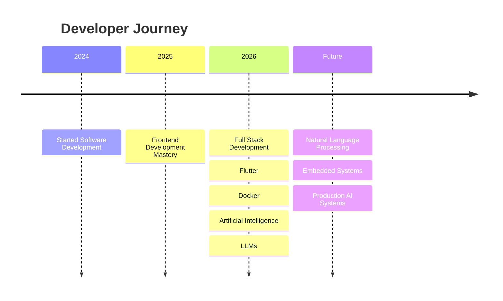

<div align="center"> <!-- Animated Header -->  <!-- Typing Animation --> <a href="https://git.io/typing-svg">

</a> <p align="center">
  <em>Building scalable systems, intelligent agents, and elegant user experiences.</em>
</p> <!-- Social Badges --> <p align="center">
  <a href="https://github.com/Khaled-alshaibani"></a>
  <a href="https://linkedin.com/in/Khaled-alshaibani"></a>
  <a href="https://twitter.com/Khaled-alshaibani"></a>
  <a href="mailto:khaled@example.com"></a>
</p>  </div>

## 🌌 About Me

I am a passionate software engineer dedicated to crafting high-performance applications and exploring the frontiers of artificial intelligence. My expertise spans across the entire stack, from designing resilient backend architectures to developing intuitive mobile interfaces.

I thrive on solving complex problems and continuously expanding my technical horizons. My core interests include:

- **Building scalable backend systems** that handle high traffic with ease.

- **Mobile development** focusing on seamless, cross-platform experiences.

- **Artificial Intelligence**, particularly Large Language Models (LLMs ) and intelligent agents.

- **System Design** and **Clean Architecture** principles to ensure maintainable codebases.

- **Learning new technologies** to stay ahead in a rapidly evolving industry.

<div align="center">

</div>

## 🚀 Technology Universe

### 💻 Programming Languages

<p align="center">
<a href="https://skillicons.dev">
    
  </a>
</p>

### 🌐 Web Development

**Frontend:**

<p align="center">
<a href="https://skillicons.dev">
    
  </a>
</p>

**Backend & APIs:**

<p align="center">
<a href="https://skillicons.dev">
    
  </a>
</p>

**Testing & Auth:**

<p align="center">

  
  
</p>

### 📱 Mobile & Desktop Development

<p align="center">
<a href="https://skillicons.dev">
    
  </a>
  
</p>

### 🧠 Artificial Intelligence

<p align="center">
<a href="https://skillicons.dev">
    
  </a>
    

  
  
  
  
  
  
    

  
  
  
  
</p>

### 🗄️ Databases & DevOps

<p align="center">
<a href="https://skillicons.dev">
    
  </a>
  
</p> <div align="center">
  
</div>


<!-- <div align="center">
## 🏗️ Architecture Ecosystem

</div> <div align="center">
  
</div> -->

## 🎯 Current Focus

<table align="center">
<tr>
    <td align="center" width="50%">
      <h3>📚 Currently Learning</h3>
      <ul align="left">
        <li>🧠 LLM Engineering & AI Agents</li>
        <li>🔥 PyTorch & Deep Learning</li>
        <li>🐳 Docker & Containerization</li>
        <li>🏗️ Advanced Backend Architecture</li>
      </ul>
    </td>
    <td align="center" width="50%">
      <h3>🛠️ Currently Building</h3>
      <ul align="left">
        <li>⚡ High-Performance Backend APIs</li>
        <li>📱 Cross-Platform Flutter Applications</li>
        <li>🤖 AI-Powered Intelligent Applications</li>
      </ul>
    </td>
  </tr>
</table> <div align="center">
  
</div>

## 💡 Developer Philosophy

> *"Software is not just about writing code. It is about solving real-world problems with elegant solutions."*

<div align="center">

</div>

## 📊 GitHub Analytics

<div align="center">

  
</div>   
 <div align="center">
  
</div>   
 <div align="center">
  <!--  -->
</div>   
 <div align="center">
  
</div>   
 <div align="center">
  
  
  
</div> <div align="center">
  
</div>

## 🐍 Contribution Snake

<div align="center">
<picture>
    <source media="(prefers-color-scheme: dark )" srcset="https://raw.githubusercontent.com/Khaled-alshaibani/Khaled-alshaibani/output/github-contribution-grid-snake-dark.svg">
    <source media="(prefers-color-scheme: light )" srcset="https://raw.githubusercontent.com/Khaled-alshaibani/Khaled-alshaibani/output/github-contribution-grid-snake.svg">
    
  </picture>
</div> <div align="center">
  
</div>

## 🗺️ Timeline & Roadmap



<div align="center">

</div>

## 💻 Developer Dashboard

```
user@sandbox:~$ ./status.sh

[SYSTEM STATUS]
Frontend     [██████████] 100%
BackEnd      [█████████░] 90%
Flutter      [███████░░░] 70%
AI           [██████░░░░] 60%
DevOps       [█████░░░░░] 50%
Learning     [██████████] 100%

[ENVIRONMENT]
OS           Ubuntu / Wndows
Editor       VS Code / Cursor
Terminal     Zsh 
Browser      Brave / Chrome
```

<div align="center">

</div>

## 📡 Tech Radar

| 🟢 Mastered | 🟡 Experienced | 🔵 Currently Learning | 🟣 Future Goals |
| --- | --- | --- | --- |
| Python, JavaScript | TypeScript, Dart | LLMs, RAG | embedded systems |
| Node.js, Express | React, Next.js | PyTorch, AI Agents | NLP |
| SQL, Git | Flutter, Docker | Advanced Architecture | MLOps |

<div align="center">

</div>

## 📬 Let's Connect

<p align="center">
<a href="https://github.com/Khaled-alshaibani"></a>
  <a href="https://linkedin.com/in/Khaled-alshaibani"></a>
  <a href="https://twitter.com/Khaled-alshaibani"></a>
  <a href="mailto:khaled@example.com"></a>
</p> <!-- Animated Footer --> <div align="center">
  
</div>
